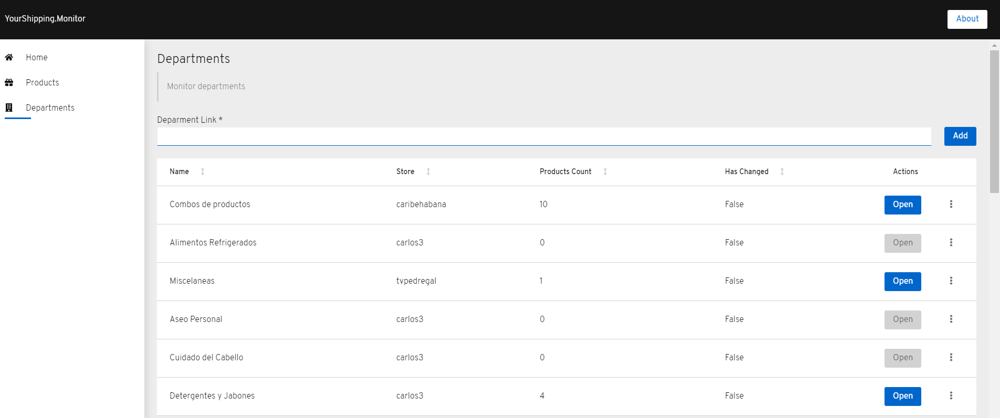
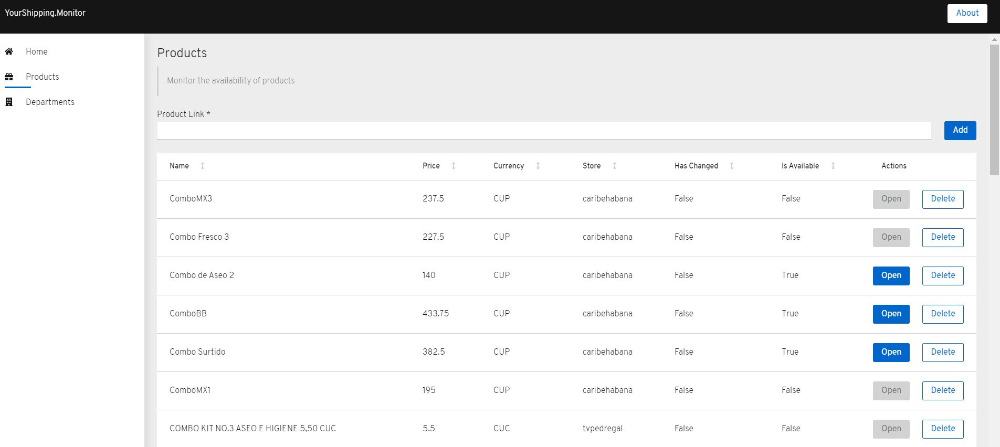

# YourShipping.Monitor

YourShipping (a.k.a. TuEnvio) has no public monitoring and notifications options. This is a basic app to monitoring specific departments and products from its well-known uri.

The goal is "similar" to [camelcamelcamel](https://camelcamelcamel.com) but in this case the target is [TuEnvio](https://www.tuenvio.cu/).

## Create your own telegram bot

Follow this documentation to create your telegram bot https://core.telegram.org/bots. 

## Build the docker image

    powershell -ExecutionPolicy ByPass -File build.ps1 -script "%CHECK_OUT_DIR%\build.cake" -target "DockerBuild" -verbosity normal

## Execute the container

    docker run -d --name your-shipping-monitor --rm -p 80:80 -v %APP_DIR%\data:/app/data -v %APP_DIR%\logs:/app/logs -e "TelegramBot:Token=%TELEGRAM_BOT_TOKEN%" your-shipping-monitor:latest
    
### Mount products in the shopping cart

In oder to mount products in the shopping cart the user must be authenticated. This is an "incomplete" feature. So, you can create a pull request ;) or just save the `cookies.txt` file in the data directory.

You can export the `cookies.txt` by using this extension https://chrome.google.com/webstore/detail/cookiestxt/njabckikapfpffapmjgojcnbfjonfjfg?hl=es-419
